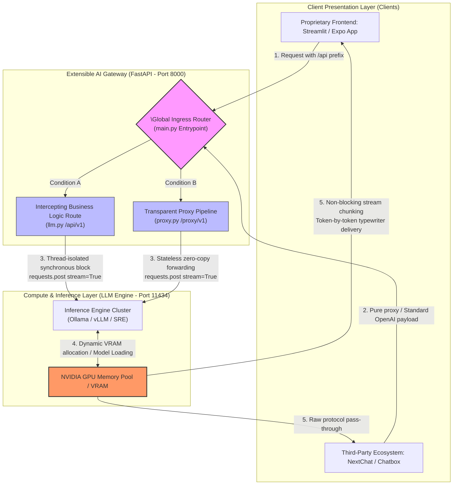

# Smart LLM Router 🚀

A generalized, lightweight, and extensible **AI Gateway & Routing Framework** built with FastAPI and Streamlit. 

This project provides a production-ready solution to a common industry bottleneck: `HTTPX ReadTimeout` and `502 Bad Gateway` errors caused by **cold-starts, weight loading latencies, and large context initializations** when running open-source LLMs (e.g., DeepSeek-R1, Llama-3) on consumer-grade or private GPU clusters.

---

## 🏗️ Architecture: Zero-Timeout Streaming Pipeline

The framework establishes a rock-solid, zero-timeout protocol contract across three decoupled layers to ensure flawless, interruption-free token streaming:

1. **Client Layer (Frontend)**: Configured with infinite waiting clocks (`timeout=None`) via chunk-based stream consumers, delivering a smooth typewriter effect without premature connection drops.
2. **Gateway Layer (FastAPI Broker)**: Utilizing an asynchronous thread-bridge (`anyio.to_thread`), the gateway wraps synchronous, zero-overhead blocking streams (`requests.post(stream=True)`). It acts as a stateless pipeline, immediately yielding tokens as they arrive from the inference engine.
3. **Inference Layer (Backend Engine)**: Dispatches compute tasks directly to local or remote runtime engines (e.g., Ollama, vLLM, Hugging Face TGI), isolating resource-heavy weight loading from network transport layers.

---

## 🌟 Extensible Dual-Mode Routing Design

The framework is explicitly engineered for **horizontal scalability**. By decoupling routes via isolated API prefixes in `main.py`, it concurrently addresses two distinct architectural patterns:

*   **Custom Business Gateway (`/api/v1` via `llm.py`)**  
    Designed for bespoke application pipelines (e.g., React Native/Expo mobile apps, enterprise web frontends). This route serves as an interception layer where developers can inject domain-specific business logic, such as:
    *   Dynamic context aggregation & system prompt injection.
    *   Retrieval-Augmented Generation (RAG) vector database lookups.
    *   Structured data post-processing (e.g., sports analytics, spaced-repetition card generation).

*   **Transparent Proxy Pipe (`/proxy/v1` via `proxy.py`)**  
    An upstream-agnostic, zero-modification passthrough proxy. It allows immediate integration with mature, out-of-the-box open-source UI clients (e.g., NextChat, Chatbox, LobeChat) by acting as a highly resilient, standard OpenAI-compatible middleware.

---

## 📊 Topology & Data Flow

The data flow diagram below illustrates how incoming traffic is dynamically intercepted and routed according to its structural blueprint:



---

## 🛠️ Quick Start

### 1. Spin up the FastAPI Gateway
```bash
uvicorn app.main:app --host 127.0.0.1 --port 8000 --reload
```

### 2. Launch the Reference Client (Streamlit)
```bash
streamlit run app/app_frontend.py
```

---

## 🔮 Future Roadmap (Generalized Extensions)

This framework is built to scale. Upcoming structural integrations include:
*   [ ] **Cost-Based LLM Routing**: Dynamically inspect input tokens and route simple queries to smaller, cost-effective local models, while dispatching complex logical requests to heavyweight commercial APIs.
*   [ ] **High-Availability Failover**: Automatic fallback routing to alternative endpoints (e.g., SiliconFlow, DeepSeek API, or AWS Bedrock) if the local inference engine experiences high load or hardware degradation.
*   [ ] **Edge KV Caching**: Integrated Redis layer to cache semantic embeddings, enabling instant responses for duplicate prompts to slice operational costs by over 90%.

---

## 🛡️ License

This project is open-sourced under the **Apache 2.0 License**. You are completely free to fork, modify, and distribute this software for personal or enterprise use. Any derivative distributions **must explicitly retain the original author attribution: Yancong Tian**.

---

## 🤝 Commercial Support & Customization

If you are looking to scale this gateway architecture within enterprise environments, or require deep-tier AI engineering implementation, I offer private commercial licensing and bespoke core development for:

1. **Intelligent Enterprise Routing Rules**: Tailoring specific multi-model fallback, load balancing, or analytical logging pipelines matched to your exact compliance/data-privacy requirements.
2. **Containerized Orchestration (Docker/K8s)**: Packaging the entire routing middleware into elastic Kubernetes pods, production-ready for AWS, Google Cloud, or private bare-metal servers.
3. **Cross-Platform Ecosystem Bridging**: Custom WebSocket or Server-Sent Events (SSE) streaming connections optimized for production mobile (React Native / Expo) and web landscapes.

📧 **Contact Email:** yctian125@gmail.com

---
*Developed with ❤️ by xyzplanet. If this framework helped you eliminate 502/Timeout bugs in your local AI stack, please drop a ⭐️-l
